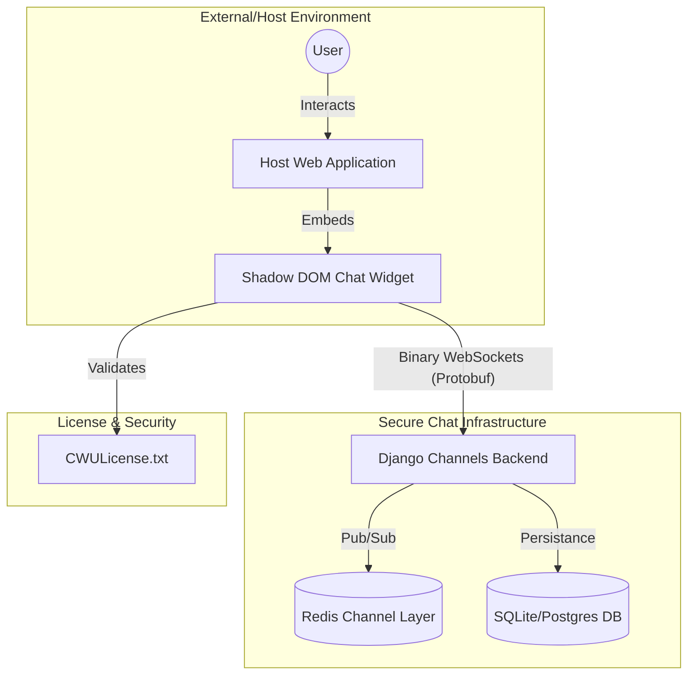
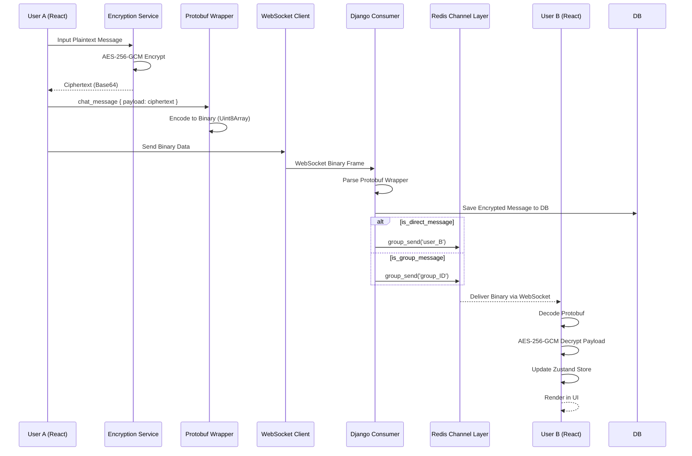
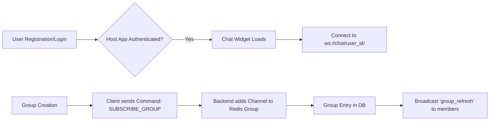
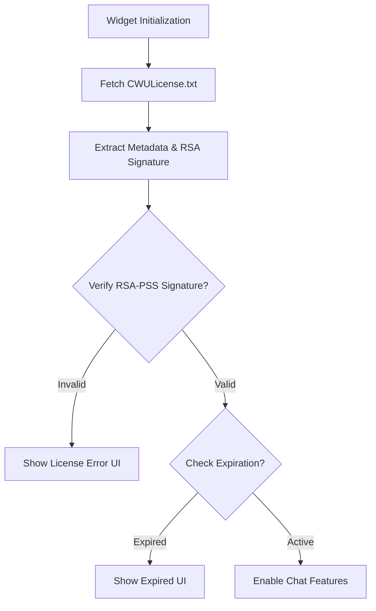

# WCA Secure Chat - High-Level Design (HLD)

## 1. System Context Diagram
The following diagram illustrates how the WCA Secure Chat widget interacts with the host application and the backend infrastructure.

## 2. Secure Chat Flow (DM & Group)
This diagram shows the end-to-end journey of a message, emphasizing the encryption and protobuf wrapping stages.

## 3. User & Group Creation Flow
How users and groups are established within the chat ecosystem.

## 4. License Verification Flow
The process ensuring only authorized clients can use the widget.

