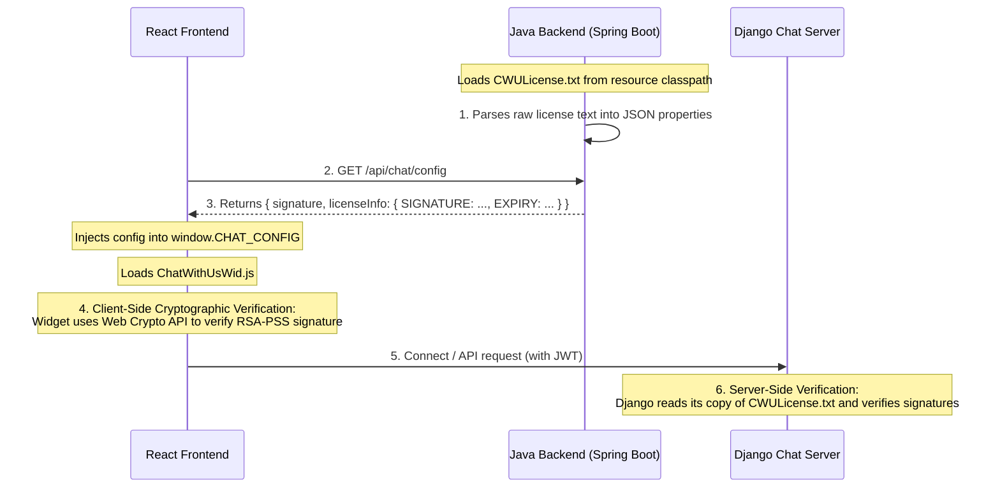

# WCA Secure Chat - React + Java Backend Integration Guide

This guide details how to integrate the compiled WCA Secure Chat widget (`ChatWithUsWid.js`) into a 3rd-party application that uses a **React Frontend** and a **Java Backend (Spring Boot)**, including detailed file placement and licensing mechanics.

---

## 1. Directory & File Placement

To keep the application secure and robust, distribute the integration assets as follows:

| Asset File | Target Location | Description |
| :--- | :--- | :--- |
| **`ChatWithUsWid.js`** | **React Frontend Asset Directory** (`public/chat/` or CDN) | The compiled React frontend widget bundle containing the shadow-root mounting logic. |
| **`CWULicense.txt`** | **Java Backend Server Classpath** (`src/main/resources/`) | The raw cryptographic license file. The backend reads and parses it to supply validation fields to the client. |
| **`SHARED_SECRET`** | **Java Backend Application Config** (`application.properties`) | A secure environment variable string matching the Django chat server's `SECRET_KEY` used for generating secure user identity signatures. |

---

## 2. Licensing Architecture & Decoding Flow

The system enforces cryptographic license protection through an **RSA-PSS signature verification** model. The license verification flow spans three zones:



### How License Decoding and Verification Happens

1. **Backend Parsing (Java)**:
   - The Java backend reads the plain-text `CWULicense.txt` line by line.
   - It extracts the metadata properties (e.g. `ISSUER`, `EXPIRY`, `ALLOWED_MODULES`) and the base64-encoded `SIGNATURE` field.
   - It converts these properties into a standard JSON map and returns it in the config response.

2. **Frontend Cryptographic Verification (React Widget)**:
   - The React widget reads `window.CHAT_CONFIG.LICENSE_INFO`.
   - It retrieves the list of `ALLOWED_MODULES` and other fields.
   - Using the **Web Crypto API** (`window.crypto.subtle.verify`), the widget verifies the signature using a built-in public key to ensure the license content has not been tampered with or modified.
   - If verification succeeds, the widget enables the corresponding UI features (e.g., read receipts, self-destruct).

---

## 3. Java Backend Implementation (Spring Boot)

### A. License Parser Utility
Create a parser class `ChatLicenseParser.java` to read and format the license text:

```java
package com.example.chat.licensing;

import java.io.BufferedReader;
import java.io.InputStream;
import java.io.InputStreamReader;
import java.nio.charset.StandardCharsets;
import java.util.HashMap;
import java.util.Map;

public class ChatLicenseParser {

    public static Map<String, String> parseLicense(InputStream licenseStream) throws Exception {
        Map<String, String> parsedData = new HashMap<>();
        String signature = null;
        boolean inLicenseBlock = false;

        try (BufferedReader reader = new BufferedReader(new InputStreamReader(licenseStream, StandardCharsets.UTF_8))) {
            String line;
            while ((line = reader.readLine()) != null) {
                line = line.trim();
                
                if (line.equals("--- CHAT WITH US LICENSE ---")) {
                    inLicenseBlock = true;
                    continue;
                }
                
                if (line.equals("--- END ---")) {
                    break;
                }

                if (inLicenseBlock) {
                    if (line.startsWith("SIGNATURE: ")) {
                        signature = line.replace("SIGNATURE: ", "");
                    } else if (line.contains(": ")) {
                        String[] parts = line.split(": ", 2);
                        parsedData.put(parts[0], parts[1]);
                    }
                }
            }
        }

        if (signature != null) {
            parsedData.put("SIGNATURE", signature);
        }
        return parsedData;
    }
}
```

### B. Controller for Identity Signing and Configuration
Implement the REST endpoint that delivers both the **identity signature** and the **parsed license data**:

```java
package com.example.chat.controller;

import com.example.chat.licensing.ChatLicenseParser;
import org.springframework.beans.factory.annotation.Value;
import org.springframework.core.io.Resource;
import org.springframework.core.io.ResourceLoader;
import org.springframework.http.ResponseEntity;
import org.springframework.security.core.annotation.AuthenticationPrincipal;
import org.springframework.security.core.userdetails.UserDetails;
import org.springframework.web.bind.annotation.GetMapping;
import org.springframework.web.bind.annotation.RequestMapping;
import org.springframework.web.bind.annotation.RestController;

import javax.crypto.Mac;
import javax.crypto.spec.SecretKeySpec;
import java.nio.charset.StandardCharsets;
import java.util.HashMap;
import java.util.Map;

@RestController
@RequestMapping("/api/chat")
public class ChatConfigController {

    @Value("${chat.shared-secret}")
    private String sharedSecret;

    @Value("${chat.server.api-url}")
    private String apiBaseUrl;

    @Value("${chat.server.ws-url}")
    private String wsBaseUrl;

    private final ResourceLoader resourceLoader;

    public ChatConfigController(ResourceLoader resourceLoader) {
        this.resourceLoader = resourceLoader;
    }

    @GetMapping("/config")
    public ResponseEntity<Map<String, Object>> getChatConfig(
            @AuthenticationPrincipal UserDetails userDetails) {
        try {
            String username = userDetails.getUsername();
            
            // 1. Generate identity signature (HMAC-SHA256)
            Mac mac = Mac.getInstance("HmacSHA256");
            SecretKeySpec secretKey = new SecretKeySpec(
                sharedSecret.getBytes(StandardCharsets.UTF_8), 
                "HmacSHA256"
            );
            mac.init(secretKey);
            byte[] rawHmac = mac.doFinal(username.getBytes(StandardCharsets.UTF_8));
            
            StringBuilder signatureHex = new StringBuilder();
            for (byte b : rawHmac) {
                signatureHex.append(String.format("%02x", b));
            }

            // 2. Load and parse CWULicense.txt from classpath resources
            Resource licenseResource = resourceLoader.getResource("classpath:CWULicense.txt");
            Map<String, String> licenseInfo = ChatLicenseParser.parseLicense(
                licenseResource.getInputStream()
            );

            // 3. Assemble response payload
            Map<String, Object> response = new HashMap<>();
            response.put("username", username);
            response.put("signature", signatureHex.toString());
            response.put("apiBaseUrl", apiBaseUrl);
            response.put("wsUrl", wsBaseUrl + "/chat/ws/chat/" + username + "/");
            response.put("licenseInfo", licenseInfo);

            return ResponseEntity.ok(response);
        } catch (Exception e) {
            return ResponseEntity.status(500).build();
        }
    }
}
```

---

## 4. React Frontend Integration

Create an integration component `ChatWidget.jsx` in your React host project:

```jsx
import React, { useEffect, useState } from 'react';

const ChatWidget = ({ userSessionToken }) => {
  const [isLoaded, setIsLoaded] = useState(false);
  const [error, setError] = useState(false);

  useEffect(() => {
    // 1. Retrieve the configuration and license details from the Java Backend
    fetch('/api/chat/config', {
      headers: {
        'Authorization': `Bearer ${userSessionToken}`,
        'Content-Type': 'application/json'
      }
    })
      .then(res => {
        if (!res.ok) throw new Error('Could not load configuration');
        return res.json();
      })
      .then(data => {
        // 2. Inject parameters into the global CHAT_CONFIG object
        window.CHAT_CONFIG = {
          USER_ID: data.username,
          IDENTITY_SIGNATURE: data.signature,
          API_BASE_URL: data.apiBaseUrl,
          WS_URL: data.wsUrl,
          LICENSE_INFO: data.licenseInfo
        };

        // 3. Dynamically inject the Chat Widget script
        const scriptId = 'chat-widget-loader';
        if (!document.getElementById(scriptId)) {
          const script = document.createElement('script');
          script.id = scriptId;
          script.src = '/chat/ChatWithUsWid.js'; // Served from public/chat/ directory
          script.type = 'module';
          script.async = true;
          document.body.appendChild(script);
        }
        setIsLoaded(true);
      })
      .catch(err => {
        console.error('Chat Widget mount failed:', err);
        setError(true);
      });
  }, [userSessionToken]);

  if (error) return <div style={{ color: '#ef4444' }}>Chat connection error</div>;
  return null; // Mounts floating shadow root directly to the document body
};

export default ChatWidget;
```

---

## 5. Security Summary Checklist

* **Zero Secret Exposure**: The `SHARED_SECRET` is kept strictly in Java memory/properties. The client React application only receives the one-off signature and never learns the secret.
* **Cryptographic Tamper Prevention**: If anyone alters the parsed `licenseInfo` keys or allowed modules in the frontend, the widget's internal Web Crypto signature validation detects the change and locks down the application instantly.

---

## 6. License Hot Reloading

When the license file (`CWULicense.txt`) is updated, you can configure the system to hot-reload and pick up the new license details instantly without restarting the servers:

### A. Django Chat Server
The central chat server has **no cache** in its verification pipeline. Every request to `LicensingService.get_license_info()` opens and reads the raw file from disk dynamically. Therefore, any update to the license file on the Django machine is immediately reflected on all new WebSocket and API requests without a server restart.

### B. Java Backend (Spring Boot Host)
* **Using Classpath Resources (`classpath:CWULicense.txt`)**: 
  Resources stored inside a compiled Spring Boot JAR are zipped and immutable at runtime. A change to a classpath resource requires rebuilding/redeploying the JAR.
* **Using External Filesystem Storage (Recommended for Hot Reloading)**:
  To allow hot-reloading on the Java host, load the license from a configurable file system path:
  
  ```java
  // In ChatConfigController.java:
  // Instead of classpath:CWULicense.txt, use file: pointing to a local file system path
  Resource licenseResource = resourceLoader.getResource("file:/etc/wca/CWULicense.txt");
  ```
  Since the controller opens and parses the file stream on every `/api/chat/config` request, any update to `/etc/wca/CWULicense.txt` on the server disk will take effect **instantly** on the next request.

### C. React Frontend
The React client fetches the license information on page mount. 
* To apply a changed license to the frontend client, the user needs to **refresh the page** (or re-mount the `ChatWidget` component), which triggers a new `/api/chat/config` fetch call. No rebuild of the frontend application is required.

