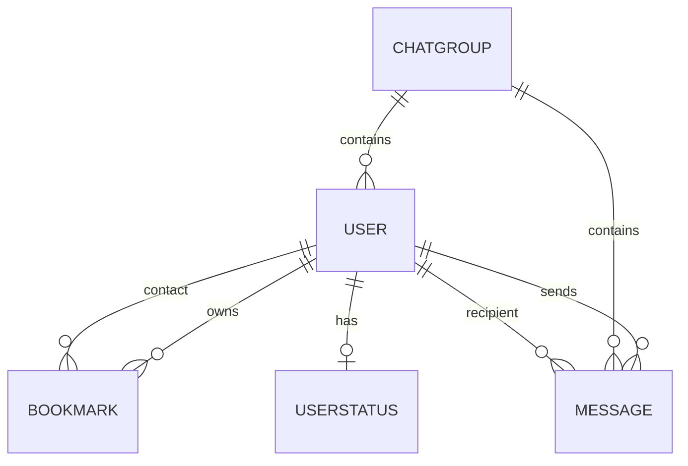

# Backend Technical Documentation

## Overview
The backend is a Django application named `chat` designed for high-concurrency real-time communication. It utilizes **Django Channels 4.0+** to handle asynchronous networking and **Protocol Buffers** for efficient data serialization.

### Database Schema Diagram

## Data Models (`models.py`)

### 1. `Bookmark`
Manages the contact list for individual users.
- **Fields**:
  - `user`: ForeignKey to the owner.
  - `bookmarked_user`: ForeignKey to the contact.
  - `is_verified`: Boolean. If `False`, the contact is in the "Unverified" tab (auto-added upon receiving a DM from a non-contact).
- **Rationale**: Separating "verified" contacts from "stashed" or "new" contacts allows for better spam control and UI organization.

### 2. `ChatGroup`
Groups allow for N-way communication.
- **Fields**:
  - `members`: ManyToManyField to Users.
  - `admins`: ManyToManyField to Users (subset of members).
- **Rationale**: Groups are synchronized in real-time. When a member is added/removed, all members receive a notification to refresh their group list.

### 3. `Message`
The primary storage for all conversations.
- **Fields**:
  - `sender`: User model.
  - `recipient` / `group`: Targets for the message (polymorphic relationship logic in consumer).
  - `message_id`: Client-generated unique ID (used for deduplication on the frontend).
- **Rationale**: Storing messages allows for **History Retrieval**. The `api_chat_history` view fetches based on these links.

### 4. `UserStatus`
Persists the activity state of a user.
- **Fields**: `status` (Integer 0-3).
- **Rationale**: Keeping this in the DB ensures that when Alice refreshes her browser, her "Away" status is restored, and Bob still sees her as "Away".

---

## WebSocket Consumer (`consumers.py`)

### `ChatConsumer(AsyncWebsocketConsumer)`
Handles the active lifecycle of a Socket connection.

#### `connect(self)`
- **Input**: WebSocket handshake request.
- **Output**: Connection acceptance or rejection.
- **Logic**: Adds the user to their personal group `user_<username>`.
- **Rationale**: Every user has a unique channel group so DMs can be routed directly to them.

#### `receive(self, text_data=None, bytes_data=None)`
- **Input**:
  - `bytes_data`: Protobuf binary buffer (used for chat messages).
  - `text_data`: JSON string (used for administrative commands).
- **Output**: None directly (usually triggers a broadcast).
- **Logic**:
  1. Decodes binary data using `ProtocolWrapper`.
  2. If `chat_message`: Persists to DB via `save_message_to_db` and broadcasts to target group.
  3. If `command`: Handles `SUBSCRIBE_GROUP` or `UNSUBSCRIBE_GROUP`.

#### `chat_message(self, event)`
- **Input**: Event dict from channel layer.
- **Logic**: Forwards the binary data to the client.
- **Rationale**: This is the "internal" handler that Django Channels calls when `group_send` is used.

#### `save_message_to_db(self, message)`
- **Input**: Decoded Protobuf object.
- **Logic**: Uses `database_sync_to_async` to interact with the Django ORM safely without blocking the event loop.

---

## API Views (`views.py`)

### `api_chat_history(request, chat_id)`
- **Input**: URL param `chat_id`.
- **Output**: JSON containing a list of objects: `{ sender, content, timestamp, message_id }`.
- **Rationale**: Returns the last 50 messages to ensure the chat window isn't empty on load.

### `api_set_status(request)`
- **Input**: JSON body `{ "status": int }`.
- **Logic**:
  1. Updates `UserStatus` table.
  2. Fetches all users who have bookmarked the sender.
  3. Broadcasts a `presence.update` event to those users' personal groups.
- **Rationale**: This ensures real-time UI updates for contacts across the system.

### `api_export_messages(request, chat_id)`
- **Input**: Date range query parameters.
- **Output**: An `HttpResponse` with `content_type='text/plain'` and attachment metadata.
- **Rationale**: Allows users to archive conversations in a readable format.

## Internal Utilities & Protocols

### Protobuf Compilation (`protocols/`)
- **`messages.proto`**: The IDL (Interface Definition Language) file.
- **`messages_pb2.py`**: Generated by `protoc`. This file is used by the consumer to encode/decode binary WebSocket frames.
- **Regeneration**: To regenerate, run `protoc --python_out=. messages.proto` inside the `protocols/` directory.

### Async Database Helpers
The backend uses `database_sync_to_async` extensively because Django's ORM is synchronous. This allows the ASGI event loop to remain responsive while waiting for database I/O.
- **Example**: `ChatConsumer.save_message_to_db()` wraps `Message.objects.create()` to ensure non-blocking execution.
