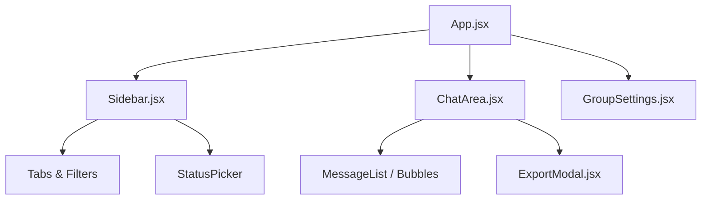

# Frontend Technical Documentation

## Overview
The frontend is a modern, single-page application (SPA) built with **React** and **Vite**. It is designed to be embedded as a widget or a standalone page. It prioritizes performance and real-time responsiveness using **Zustand** for state management.

### Component Hierarchy Diagram

---

## Global State Management (`useChatStore.js`)
State is managed using a flat, reactive store. This avoids "prop drilling" and ensures real-time updates from WebSockets are reflected instantly.

### Core State Properties
- `messagesByChat`: (Map) Stores lists of messages keyed by `chatId`.
- `presence`: (Map) Stores activity status (0-3) keyed by `userId`.
- `unreadCounts`: (Map) Tracks count of unread messages for notifications.
- `activeChatId`: (String) The ID of the currently viewing chat.
- `bookmarks`: (Array) List of verified contact objects.

### Critical Actions
#### `addMessage(chatId, message)`
- **Logic**: Appends a message to the corresponding list. If the `chatId` is not the `activeChatId`, it increments the `unreadCounts` for that ID.
- **Rationale**: Ensures users are notified of new messages even when not looking at that specific chat.

#### `updatePresence(userId, status)`
- **Logic**: Updates the status in the central map.
- **Rationale**: Any component observing this user will automatically re-render with the new status (e.g., green dot for Active).

---

## Services

### 1. `WebSocketClient.js` (Singleton)
Manages the persistent connection to the Django server.

#### `onmessage(event)`
- **Logic**: Handles incoming data. 
  - If binary: Decodes via Protobuf.
  - If JSON: Checks `type`.
- **Flow**: 
  - `presence_update` -> Triggers `store.updatePresence`.
  - `group_refresh` -> Triggers re-fetching of group lists.

### 2. `api.js`
Thin wrapper around the `fetch` API for REST interactions.
- **`setUserStatus(status)`**: POSTs to the backend. **Rationale**: Triggered by user interaction in the Sidebar.
- **`fetchHistory(chatId)`**: GETs previous messages. **Rationale**: Loads the last 50 messages to provide continuity.

---

## Main UI Components

### `ChatArea.jsx`
The primary interaction window.
- **Props**: `messages`, `currentUser`, `onSendMessage`.
- **Local State**: `inputText` (String).
- **Features**:
  - **Auto-Scroll**: Uses a `useEffect` hook to scroll to the bottom when `messages` change.
  - **Unread Marker**: Displays a "● N New" banner at the start of new, unread content based on `openedUnread`.

### `Sidebar.jsx`
Navigational component.
- **Features**:
  - **Tabs**: Logic to filter between All, Contacts (Verified), Groups, and Unverified.
  - **Status Picker**: A dropdown and button that calls `api.setUserStatus`.
  - **Search**: (Planned/Basic) Local filtering of the chat list.

### `GroupSettings.jsx`
Administrative interface for groups.
- **Props**: `onBack`, `group`.
- **Logic**: Allows members to leave and admins to rename the group or manage members.
- **UI**: Uses a premium, glassmorphism-inspired design with heavy focus on readability.

### `ExportModal.jsx`
Utility for chat archiving.
- **Local State**: `startDate`, `endDate`.
- **Action**: Generates a URL for the backend's export endpoint and triggers a browser download.

---

## UI Encapsulation (Shadow DOM)
To prevent CSS conflicts when embedded in 3rd-party applications, the widget can be encapsulated using the browser's **Shadow DOM**. 
- **Implementation**: The React root is attached to a shadow root instead of a physical DOM element.
- **Benefit**: This ensures that 3rd-party site styles (like conflicting Tailwind versions or global h1 styles) do not affect the chat widget's "Premium" appearance.

## Synchronization Flow
1. **Event**: Socket receives a byte array.
2. **Transform**: `WebSocketClient` decodes it into a JS object.
3. **Internal Route**:
   - If it's a message -> `store.addMessage`.
   - If it's a presence signal -> `store.updatePresence`.
4. **Reactive UI**: React detects the store change and updates specific components (e.g., the message list or the status icon).
