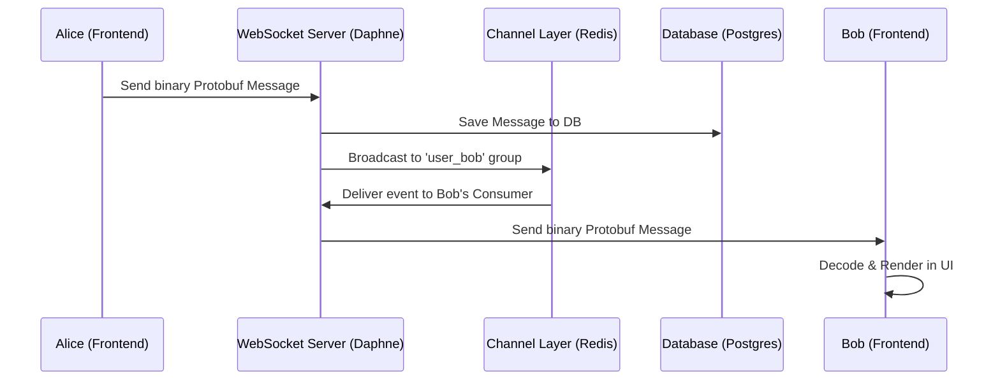

# System Architecture Documentation

## Overview
The "CHAT WITH US" application is a real-time, multi-user chat system integrated into a larger Django ecosystem. It leverages **Django Channels** for persistent WebSocket connections and a **React-based frontend** for a dynamic, reactive user interface.

### Expectations from Main Application
To function correctly, the chat module expects the following from the host Django application:
- **Authentication**: A logged-in `User` object must be available in the request.
- **User Attributes**: The `User` model must provide a `username`.
- **Session Management**: standard Django session cookies must be present for WebSocket authentication.
- **CSRF Protection**: A valid CSRF token must be provided for REST API POST/PUT requests.
- **Static File Hosting**: The host must serve the compiled `widget.js` and associated CSS.

### Required Ports
| Component | Port | Purpose |
|-----------|------|---------|
| Django/Daphne | 8000 | Main Web and WebSocket server. |
| Redis | 6379 | Channel layer backend for real-time broadcasting. |
| Database (PostgreSQL) | 5432 | Persistent storage (optional/recommended for scale). |

## Security Architecture

### 1. Authentication & Authorization
- **WebSocket Auth**: Uses standard Django session-based authentication. The `ChatConsumer` accesses `self.scope['user']` to identify the connected sender.
- **REST APIs**: Secured with the `@login_required` decorator.

### 2. Message Encoding & Security
- **Binary Protocol (Protobuf)**: Messages are encoded into a binary format using Google's Protocol Buffers. This provides a layer of security by obscurity (non-human readable over the wire) and significant performance gains.
- **Encryption (At Rest)**: Data is stored in the database using standard Django ORM practices. For high-security environments, Transparent Data Encryption (TDE) at the database level is recommended.
- **Encryption (In Transit)**: All WebSocket and REST traffic MUST be served over **TLS/SSL (WSS/HTTPS)**. This ensures that the binary Protobuf payloads are encrypted cryptographically between the client and server.
- **Application-Level Encryption (Planned/Optional)**: For End-to-End Encryption (E2EE), the system is designed to support an encrypted payload field within the Protobuf `ChatMessage` where the client encrypts the content using a shared AES key before encoding.
- **Input Sanitization**: Content is sanitized on both the frontend (React's built-in XSS protection) and the backend (Django's ORM and template engine).

### 3. Data Privacy
- **Direct Messages**: Logic in `consumers.py` ensures messages are only broadcasted to the intended recipient's personal channel group.
- **Group Privacy**: Membership is verified before adding a user to a group's channel group.

## High-Level Design (HLD) with Example

### Example Scenario: Alice sends a message to Bob
1. **Initiation**: Alice types "Hello Bob" in the UI.
2. **Frontend Encoding**: The React app creates a `ChatMessage` object, encodes it into a Protobuf binary buffer, and sends it via the WebSocket.
3. **Backend Processing**: 
   - The `ChatConsumer` receives the binary blob.
   - It decodes it using `messages_pb2.py`.
   - It identifies Alice as the sender and Bob as the recipient.
4. **Persistence**: The consumer saves the message to the database (PostgreSQL/SQLite).
5. **Broadcasting**: The consumer tells the Channel Layer to send a message to the group named `user_bob`.
6. **Delivery**: Bob's active WebSocket connection (which is listening to group `user_bob`) receives the message and triggers a UI update in his browser.

### Data Flow Diagram

## Scaling Specifications

The following table provides hardware recommendations based on concurrent user numbers. These are estimates for a production environment.

| User Count | Concurrent WS | CPU | RAM | Redis Node | Notes |
|------------|---------------|-----|-----|------------|-------|
| **2,000** | ~500 | 2 Cores | 4 GB | Single Instance | Standard VPS. |
| **5,000** | ~1,500 | 4 Cores | 8 GB | Single Instance | High-performance VPS. |
| **10,000** | ~3,000 | 8 Cores | 16 GB | 1 Managed Node | Consider separating DB to its own node. |
| **20,000** | ~6,000 | Cluster (3x 4-Core) | 32 GB | Cluster (3 Nodes) | Scale horizontally with Load Balancer. |
| **50,000** | ~15,000 | Cluster (5x 8-Core) | 64 GB | Cluster (5 Nodes) | Highly available distributed setup. |

> [!TIP]
> **Horizontal Scaling**: Use a Load Balancer (like Nginx) to distribute WebSocket connections across multiple Daphne workers. Redis should be configured in a cluster for high availability at 20k+ users.
